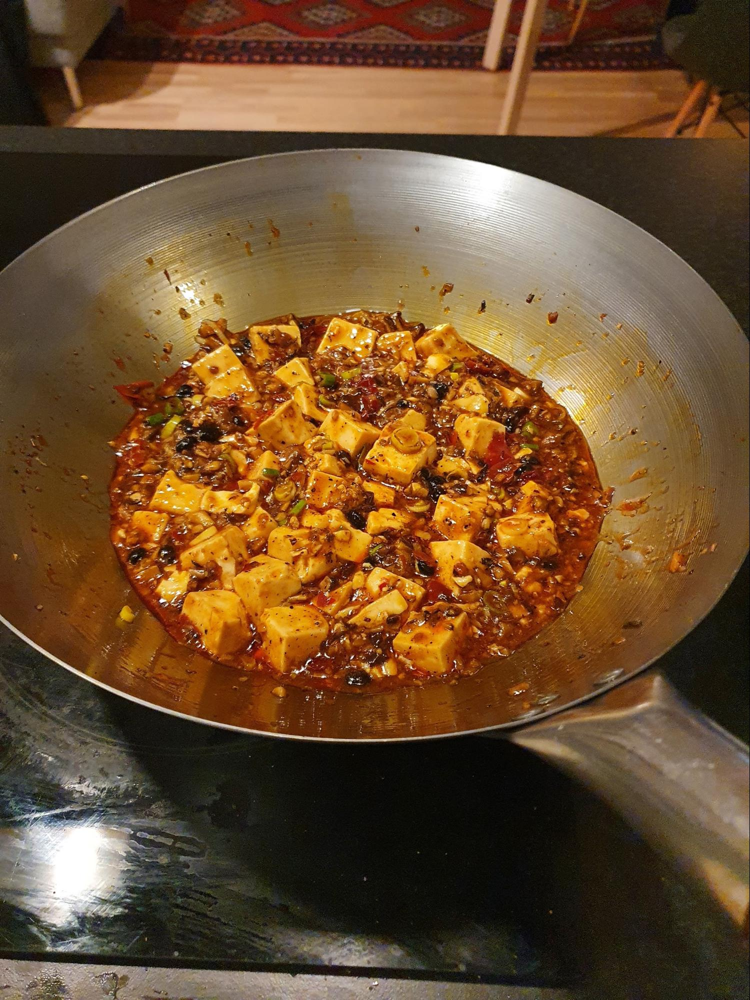
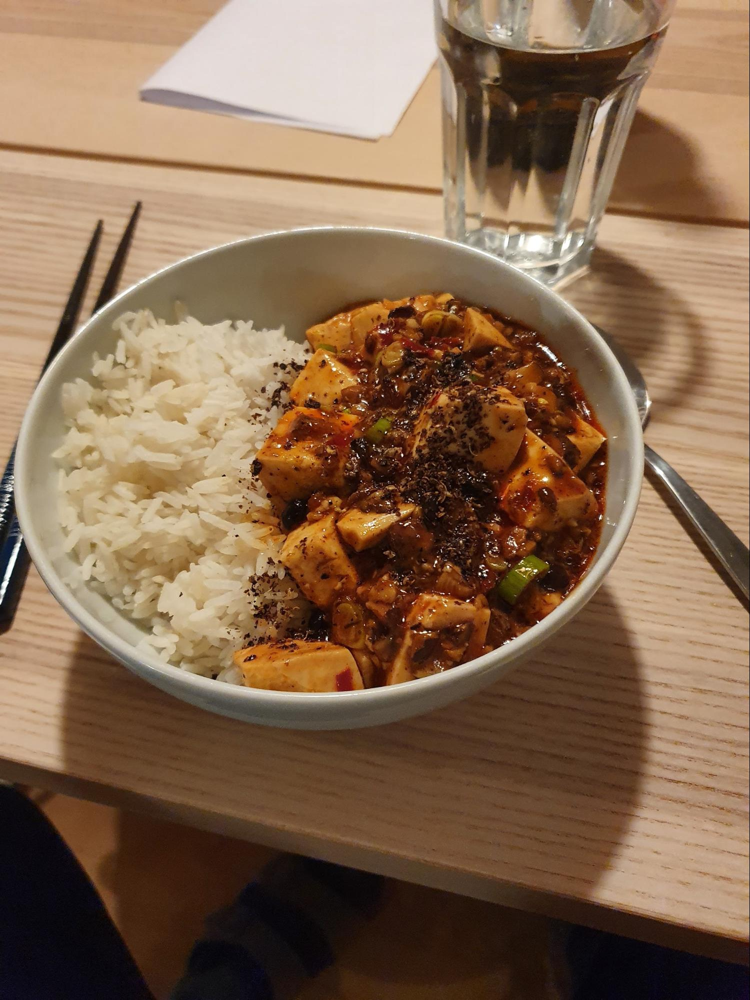

<meta name="viewport" content="width=device-width, initial-scale=1">

[![]](Figures/Mo_mapo.jpg)

[![]](Figures/Mapo.jpg)

## Ingredients

  <label for="serving">A Number of portions: </label>
  <input type="range" min="1" max="10" value="2" class="slider" id="servingInput">

  

    
 -  tablespoons vegetable oil

    
 -  tablespoons Sichuan peppercorns (coarsely ground, reserve a bit for garnish at the end)

    
 -  tablespoons ginger (finely minced)

    
 -  tablespoons garlic (finely minced)

    
 -  tablespoons fermented black beans

    
 -  Thai bird chilies (thinly sliced)

    
 -  g shiitake mushrooms (finely chopped)

    
 -  tablespoons spicy bean sauce (depending on your desired salt/spice levels)

    
 -  tablespoons light soy sauce

    
 -  tablespoon chili oil

    
 -  mL water (or vegetable or mushroom broth)

    
 -  teaspoons cornstarch (mixed with half the amount of water)

    
 -  g silken tofu (or soft tofu, cut into 1-inch cubes)

    
 -  teaspoons sesame oil

    
 -  teaspoons sugar

    
 -  scallion (finely chopped)

  

<!-- https://codepen.io/Erilan/pen/qQWpqa -->

## Instructions

First, cube the tofu and then blanch it.
In a wok over medium low heat, add the vegetable oil and ground Sichuan peppercorns (remember to reserve some for garnishing the dish at the end).
Cook for 30 seconds, and add the ginger. Cook for another 1 minute and add the garlic. Cook for another 1 minute. Add the black beans, and chilies. Cook for another 1-2 minutes.
Turn up the heat to medium, and add the mushrooms. Cook until the mushrooms are cooked down and slightly caramelized, about 5 minutes.
Add the spicy bean sauce, chili oil and light soy sauce to the mixture and stir it in well. Turn up the heat to high, and add the water or broth and stir. Bring the mixture up to a simmer, and allow to bubble for 1 minute.
Stir the cornstarch and water mixture to make sure the cornstarch is dissolved, and add it to the sauce. Allow the sauce to thicken (if it gets too thick, splash in more water or stock). If the sauce is too thin, make a little more cornstarch slurry and add it in. There will be variations depending on how high your heat is.
Add the tofu to the wok and gently toss the tofu in the sauce. Allow the tofu to simmer for 3-5 minutes, and then add the sesame oil, sugar, and scallions.
Give everything a final stir, and taste for seasoning (you likely won’t have to add any additional salt, as the spicy bean sauce and fermented black beans are quite salty). Serve over rice, garnished with a last sprinkle of Sichuan peppercorn powder.

Adapted from [this recipe](https://thewoksoflife.com/vegan-mapo-tofu/)
